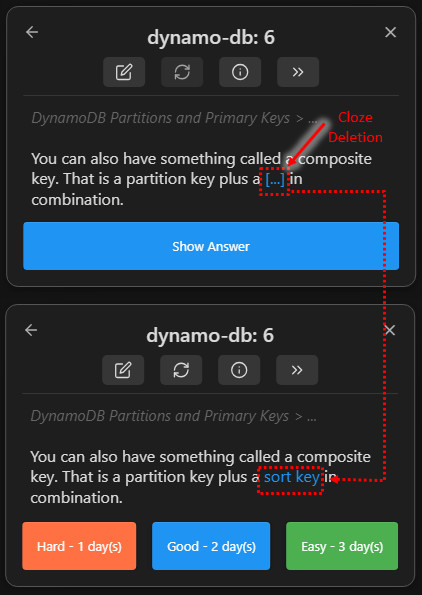

# Elegant Flashcard Authoring (Card Authoring)



## Module Overview
Turning notes into testable flashcards is the key step in building a personal spaced-repetition system (SRS). Syro's design philosophy is **"frictionless crystallization"**: you do not need to leave your current writing flow. With the most natural Markdown markers, you can generate cards directly inline.

This page introduces the main card formats supported by Syro. If you want to learn how to turn plain explanatory text into efficient test units, this is the guide to start with.

## 1. Q/A Cards
Q/A cards are the most classic and most stable flashcard format. They are especially suitable for term definitions, conceptual distinctions, or formula recall.

- **Single-line Q/A**: use the default separator `::`.
  ```markdown
  What is the Testing Effect?:: It is the phenomenon in which actively retrieving information significantly improves long-term retention.
  ```
- **Multi-line Q/A**: if the answer is longer or contains lists or images, you can use a multi-line separator (for example `?` by default, or a custom one in settings).
  ```markdown
  List three core advantages of incremental reading.
  ?
  1. Reduce cognitive fatigue
  2. Improve meta-memory judgments
  3. Spark cross-disciplinary associations
  ```

## 2. Cloze Deletions
Cloze cards are Syro's signature feature. They let you preserve the richness of the original context while hiding only the core concept.

- **Based on highlights / bold text**:
  As long as the corresponding options are enabled in settings, you can directly use Obsidian's highlight syntax `==text==` or bold syntax `**text**`.
  ```markdown
  The mitochondrion is called the ==powerhouse== of the cell because it produces the ATP needed for life.
  ```
  *(During review, the phrase `powerhouse` will be hidden and revealed after you answer.)*

- **Command shortcuts (multi-level cloze)**:
  When a paragraph contains multiple knowledge points worth testing, you can select text and run `Syro: Create Cloze (Same Level)` or `Syro: Create Cloze (New Level)` to quickly generate the standard `{{c1::text}}` format.

## 3. Advanced Card Formats
For users with more specialized layout needs, Syro also provides strong parsing support:
- **Tables and code blocks**: you can place Markdown tables or fenced code blocks directly inside the answer area. Syro will preserve the formatting and render it cleanly during review.
- **LaTeX math formulas**: for technical users, Syro fully supports LaTeX formulas wrapped in `$$` inside questions, answers, or cloze cards, so formulas display accurately during review.

## Best-Practice Suggestions
- **Atomic principle**: one card should ideally test only one core idea. If an answer runs for several hundred words, the card becomes painful to review and difficult to grade objectively.
- **Preserve context**: if a card would become ambiguous outside a specific context, place it beneath the relevant note paragraph so you can always jump back to the original source during review.
- **Keep your syntax style consistent**: Syro supports highlights, bold text, brace syntax, and more. In a personal vault, it is usually best to settle on one or two authoring patterns that feel natural to you and keep your notes tidy.

---
**Related chapter:**
- [Managing Review and Flow](./review-workflow.md)
