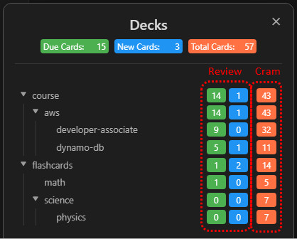

# Managing Review and Flow

## Module Overview
Once you have accumulated a large number of flashcards in your vault, the first real challenge is how to distribute your daily review energy scientifically. This page brings together the core logic of the **deck tree overview**, **review-session interaction**, and **deck-option controls**.

If you want to understand how to read the review tasks generated by the system, how to move smoothly during testing, and how to prevent daily review overload, this is the page to follow.

## 1. The Deck Tree: Your cognitive dashboard
Run `Review flashcards from all notes` to open the deck tree. Here your cards are grouped by folder or tag, and each node displays counts for three states:
- **New**: untouched territory - cards that have not yet been learned.
- **Learn**: cards in the fragile phase of short-term memory, so the system surfaces them more frequently today to prevent forgetting.
- **Due**: cards that have already entered long-term memory and have reached the critical moment for reinforcement today.

*Tip: You can collapse parent decks that do not need your attention, or trigger review from a single note when you want to focus intensely on a specific area.*

## 2. The Review Session: The arena of active recall
Click any deck that contains numbers to enter a review session. In this interface, smooth interaction is crucial for maintaining flow:
- **Show answer**: read the front of the card, search for the answer in your head, and then press the `Space` key.
- **State grading**:
  - `1 - Again (Forgot)` - you could not recall it at all. The card returns to relearning.
  - `2 - Hard (Difficult)` - you recalled it, but only with significant effort.
  - `3 - Good` - a normal recall. This is the standard rating you will use most often.
  - `4 - Easy` - the answer came out immediately. The system will push the next review much farther out.
- **Return to the source note**: if a card feels confusing, use the menu or shortcut to open the original note behind the card and re-read the full context.

## 3. Deck Options: Control daily cognitive load
Willpower is limited. If a deck produces hundreds of cards every day, frustration quickly follows. By clicking the gear icon on the right side of a deck, you can adjust its **deck options**:
- **New Cards/Day**: controls how many brand-new cards can be introduced each day. Lowering this number is the most effective way to reduce long-term review pressure.
- **Reviews/Day**: controls how many due cards can be shown each day. In most cases, it is best to keep this number relatively high so you protect memories that already exist.

## Keeping data in sync
For normal day-to-day edits, Syro quietly captures changes through **automatic incremental sync** in the background. But if you perform large-scale renames, move folders around, or delete many files at once, it is wise to run `Syro: Rebuild Cache` from the Command Palette so the algorithm's view stays perfectly aligned with your actual file state.

---
**Related chapter:**
- [Elegant Flashcard Authoring](./card-authoring.md)
