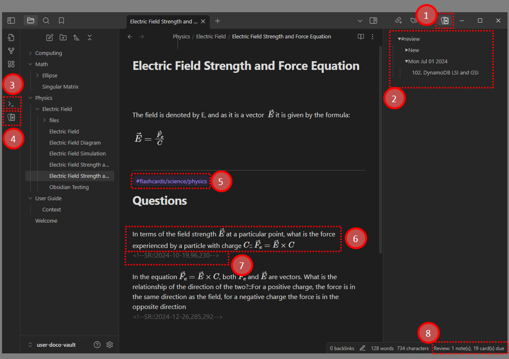

# Syro Documentation Overview

> *Note: The screenshots in this documentation are mainly provided as visual anchors. Please rely on the actual interface of the plugin version you currently have installed.*

## Welcome to Syro
Syro is an Obsidian plugin deeply tailored for knowledge scheduling. It seamlessly integrates the scientific principles of **Spaced Repetition** and **Incremental Reading** into a plain-text local knowledge base.

This official documentation is designed to help you start from zero and gradually learn how to turn static Markdown notes into dynamic review queues, so you can actively fight forgetting while building deeper contextual connections across your knowledge.

## Recommended Reading Path
To keep the learning curve manageable, we have trimmed and regrouped the documentation around the core workflows. We recommend exploring it in the following order:

### Part 1: Getting Started
Before diving into hands-on use, understanding the design philosophy behind the tool will significantly improve your efficiency.
- [Core Concepts: Spaced Repetition and Incremental Reading](./getting-started/introduction.md) - Understand the distinctive path Syro takes and the concrete problems it is designed to solve.
- [5-Minute Quick Start](./getting-started/quick-start.md) - Walk through a minimal closed loop and quickly experience the full workflow from authoring cards to reviewing them.

### Part 2: Flashcards
Focused on active recall and atomic knowledge testing.
- [Flashcards Overview](./flashcards/index.md) - Understand the overall architecture of the flashcard module.
- [Elegant Flashcard Authoring](./flashcards/card-authoring.md) - Learn the Markdown syntax rules for Q/A cards and cloze cards.
- [Managing Review and Flow](./flashcards/review-workflow.md) - Learn how to read the deck tree, score review sessions, and control your daily cognitive load.

### Part 3: Note Review
Focused on the gradual digestion of long-form literature and study material.
- [Note Review Overview](./note-review/index.md) - Understand how incremental reading is implemented inside Obsidian.
- [Managing the Note Review Queue](./note-review/queue-management.md) - Learn how to track notes, use the sidebar, and reshape reading order through tags and priority.
- [Timeline: Save Reading History and Progress](./note-review/timeline.md) - Understand how the system preserves reading context across time.

### Part 4: Advanced & FAQ
Focused on protecting your knowledge assets and solving occasional edge-case problems.
- [Data, Sync & Backup](./advanced-and-faq/data-and-sync.md) - Learn how the underlying JSON files are stored and how to sync them safely across devices.
- [FAQ & Troubleshooting](./advanced-and-faq/faq-troubleshooting.md) - Follow a standardized self-check checklist when you run into issues such as cards not being parsed or queues not updating.

---
*Appendix:*
- [Changelog](../changelog.md)
- [License](../license.md)
